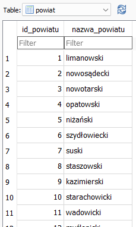

# 1 Konfiguracja
Aby używać hibernate należy do projektu dodać odpowiednie biblioteki. Jeśli projekt jest zarządzany przez narzedzie maven wystarcz odnaleźć interesujące nas zależności na stronie https://mvnrepository.com/ np.:
- Hibernate - https://mvnrepository.com/artifact/org.hibernate/hibernate-core/5.6.14.Final
- Dialekt obsługujący bazę danych np. SQLite(inne bazy danych wymagają inyych dialektów ) https://mvnrepository.com/artifact/com.github.gwenn/sqlite-dialect/0.1.2

- Sterownik JDBC https://mvnrepository.com/artifact/org.xerial/sqlite-jdbc

Po wybraniu odpowiednich wersji należy dodać je do pliku `pom.xml` wewnątrz znacznika `<dependencies>`

```xml
        <dependency>
            <groupId>org.xerial</groupId>
            <artifactId>sqlite-jdbc</artifactId>
            <version>3.40.0.0</version>
        </dependency>
        <dependency>
            <groupId>org.hibernate</groupId>
            <artifactId>hibernate-core</artifactId>
            <version>5.6.1.Final</version>
        </dependency>

        <dependency>
            <groupId>com.github.gwenn</groupId>
            <artifactId>sqlite-dialect</artifactId>
            <version>0.1.2</version>
        </dependency>
```
Aby zdefiniowane zależności zostały pobrane z internetu do naszego projektu należy wywołac odpowiednie polecenie maven. W intelij po modyfikacji pliki pom pojawia się nastepująca ikona która po naciśnięciu wywoła odpowiednią komendę.


Po pobraniu bibliotek należy skonfigurować framework. Najłatwiej utworzyć plik `hibernate.cfg.xml` przechowujący ustawienia frameworku. Plik nalezy utworzyć w taki sposób aby był widoczny bezpośrednio dla kalsy z której wywołamy metodę wczytującą ustawienia hibernate `configure()` w przeciwnym przypadku potrzebne będzie podanie ścieżki do pliku. W projektach wygenerowanych w intelij katalog Resources będzie bezpośrednio widoczny dla klas. Najlepiej w nim umieścić plik `hibernate.cfg.xml`. Przykładowa konfiguracja pliku:
```xml
<?xml version="1.0" encoding="UTF-8"?>
<!DOCTYPE hibernate-configuration PUBLIC
        "-//Hibernate/Hibernate Configuration DTD 3.0//EN"
        "http://hibernate.org/dtd/hibernate-configuration-3.0.dtd">
<hibernate-configuration>
    <session-factory>
        <!-- Adres do bazy danych C:\.. należy zastapić pełną ścieżką do bazy danych znajdującej się na komputerze  -->
        <property name="hibernate.connection.url">jdbc:sqlite:[ścieżka do bazy danych]</property>
        <property name="hibernate.connection.username">root</property>
        <property name="hibernate.connection.password">ZAQ!2wsx</property>
        <!-- Opcja będzie wypisywać zapytania SQL w konsoli -->
        <property name="hibernate.show_sql">true</property>
        <!-- scieżka do klasy sterownika -->
        <property name="hibernate.connection.driver_class">org.sqlite.JDBC</property>
        <!-- Dialekt bazy danych - silniki bazodanowe różnią się nieznacznie składnią, typami danych, funkcjami -->
        <property name="hibernate.dialect">org.sqlite.hibernate.dialect.SQLiteDialect</property>
        <!-- Opcja umożliwia zdefiniowanie zachowania przy łączeniu z bazą danych. create-drop usunie tabele a następnie utworzy je na nowo -->
        <property name="hibernate.hbm2ddl.auto">create-drop</property>

        <!-- Wskazanie klas mapujących tabele w bazie danych na obiekty java. -->
        <mapping class="com.example.main.entities.Powiat"></mapping>
        <mapping class="com.example.main.entities.Miejscowosc"></mapping>
        <mapping class="com.example.main.entities.Gmina"></mapping>

    </session-factory>
</hibernate-configuration>

```

!Od Java 11 możemy ograniczać dostęp bibliotek do naszej aplikacji i naszej aplikacji dostęp do bibliotek. Definiuje się to za pomocą pliku module-info.java który znajduje się w korzeniu naszego pakietu. W niektórych przypadkach wymagana będzie modyfikacja tego pliku by możliwe było używanie pobranych bibliotek.


# 2 Jak używać
Hibernate mapuje obiekty na bazę danych. Innymi słowy przekształca pochodzące z bazy danych na obiekty.

Przykładowo mając tabelę powiaty o następującej zawartości:


Tworzymy klasę POJO która będzie przechowywać dane z jednego wiersza naszej tabeli.

```java
package com.example.main.entities;

public class Powiat {

    private Long id_powiatu;
    String nazwa_powiatu;

    public Powiat2() {}
    public Powiat2(String nazwa_powiatu) {
        this.nazwa_powiatu = nazwa_powiatu;
    }

    public Long getId_powiatu() {
        return id_powiatu;
    }
    public void setId_powiatu(Long id_powiatu) {
        this.id_powiatu = id_powiatu;
    }

    public String getNazwa_powiatu() {
        return nazwa_powiatu;
    }
    public void setNazwa_powiatu(String nazwa_powiatu) {
        this.nazwa_powiatu = nazwa_powiatu;
    }

    @Override
    public String toString() {
        return "Powiat{" +
                "id_powiatu=" + id_powiatu +
                ", nazwa_powiatu='" + nazwa_powiatu + '\'' +
                '}';
    }
}
```
Sama klasa nie ma znaczenia, natomiast w frameworku hibernate jak i w frameworku JAXB wykorzystywane są adnotacje dzięki którym wskazujemy wfameworkowi które pola klasy odpowiadają polom w naszej tabeli. Np. jak poniżej klasa Powiat będzie odpowiatać tabeli POWIAT. Pole id_powiatu będzie podpowiadać kolumnie id_powiatu oraz będzie to kolumna będąca kluczem głównym o czym mówi adnotacja @ID:
```java
import javax.persistence.*;

@Entity
@Table(name = "POWIAT")
public class Powiat {
    @Id
    @Column(name = "id_powiatu", nullable = false)
    @GeneratedValue(strategy = GenerationType.IDENTITY)
    private Long id_powiatu;

    @Column(name = "nazwa_powiatu")
    String nazwa_powiatu;

    public Powiat(String nazwa_powiatu) {
        this.nazwa_powiatu = nazwa_powiatu;
    }

    public Powiat() {}

    public Long getId_powiatu() {
        return id_powiatu;
    }

    public void setId_powiatu(Long id_powiatu) {
        this.id_powiatu = id_powiatu;
    }

    public String getNazwa_powiatu() {
        return nazwa_powiatu;
    }

    public void setNazwa_powiatu(String nazwa_powiatu) {
        this.nazwa_powiatu = nazwa_powiatu;
    }

    @Override
    public String toString() {
        return "Powiat{" +
                "id_powiatu=" + id_powiatu +
                ", nazwa_powiatu='" + nazwa_powiatu + '\'' +
                '}';
    }
}
```

