# Hibernate

Utwórz nowy projekt JavaFX. W tym kroku bezpiecznie jest nie wybierać najnowszej wersji JAVA lecz tą wspieraną przez długi czas np. JAVA 17.


Po utworzeniu projektu i pobraniu bibliotek zlokalizuj plik POM.XML

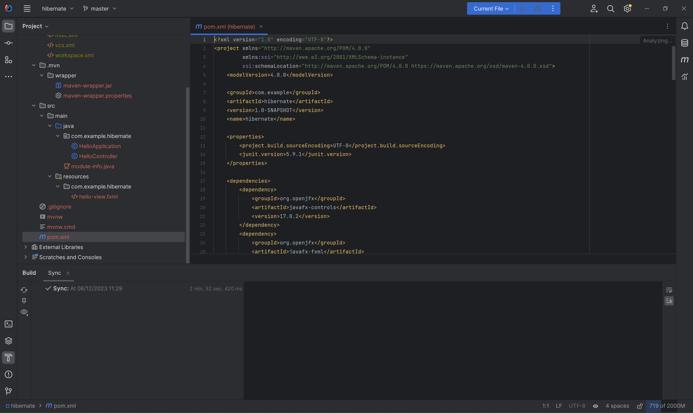

Na stronie https://hibernate.org/orm/releases/ należy znaleźć odpowiednią wersję biblioteki zgodną z naszą wersją JAVA.

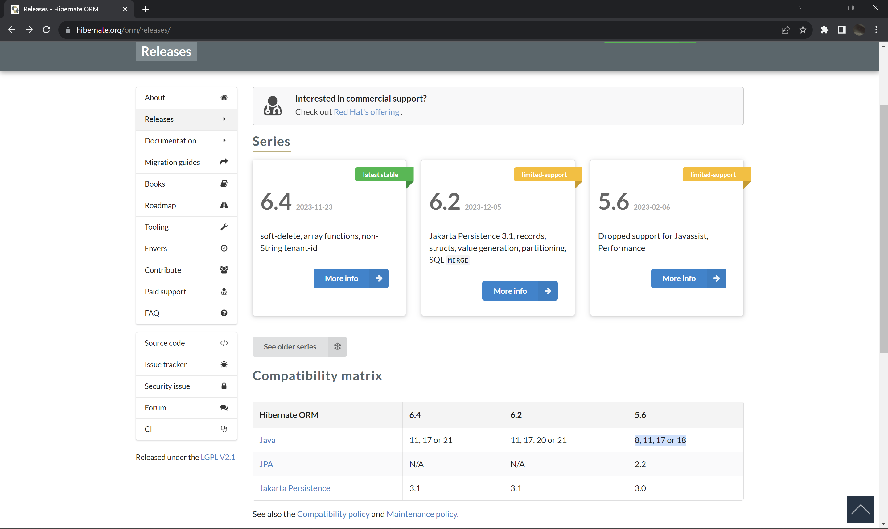

Następnie na stronie https://mvnrepository.com/ wyszukaj odpowiednią wersję biblioteki HIBERNATE, Jakarta Persistance, oraz sterownika bazy danych np. SQLite JDBC

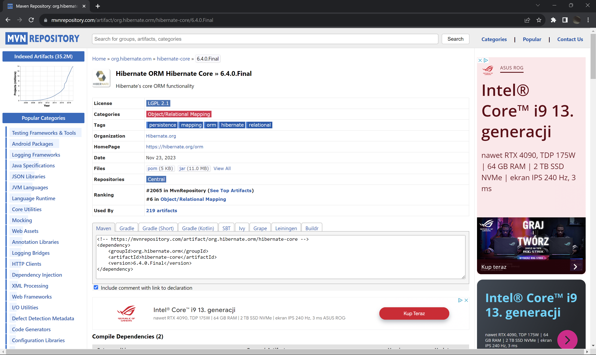

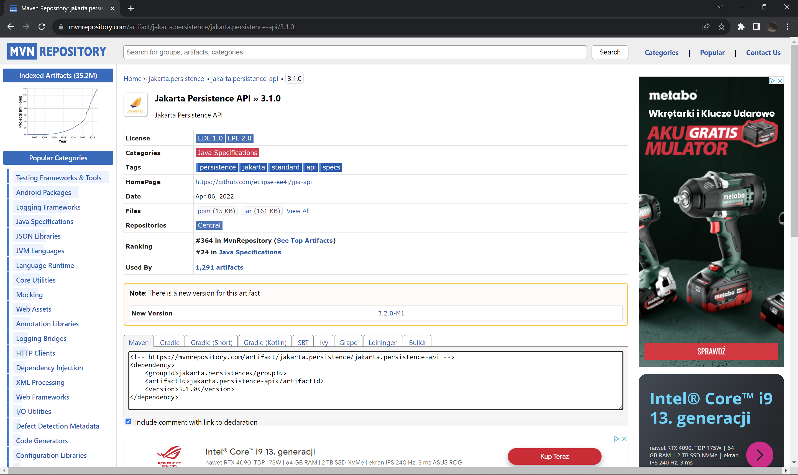

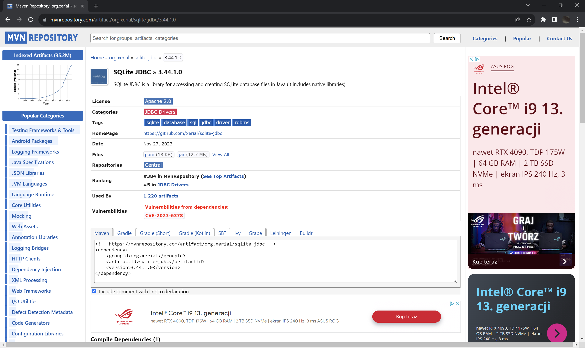

Dodatkowo będzie potrzebny dialekt silnika bazodanowego. Np. dla sqlite w hibernate w wersji https://github.com/gwenn/sqlite-dialect/

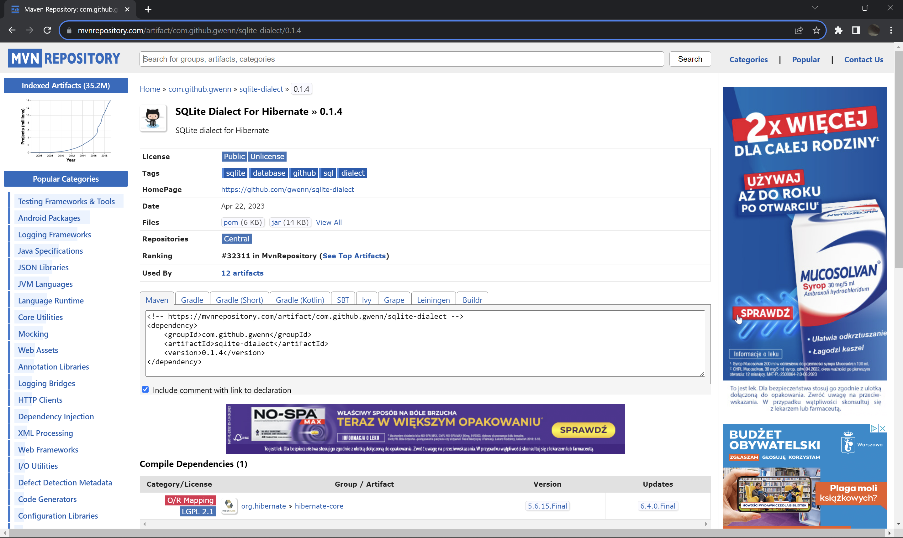

Skopiuj i wklej zależność do pliku POM.XML

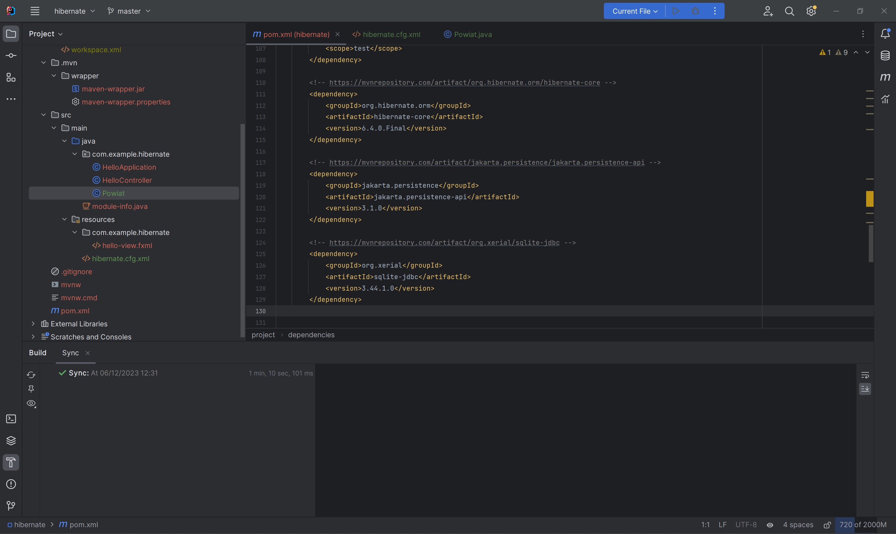

Pobierz zależności klikając w ikonę "Load maven changes".

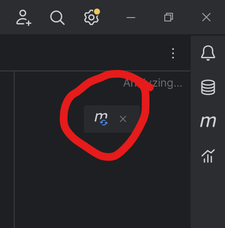

Spróbuj uruchomić projekt z automatycznie wygenerowanej klasy HelloAplication.java

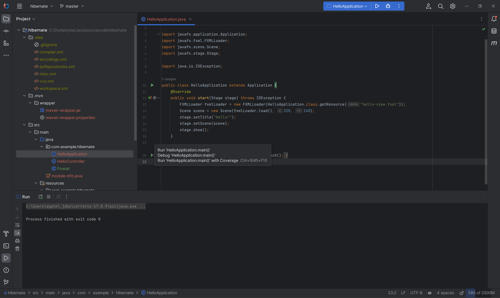

W katalogu resources utwórz plik `hibernate.cfg.xml`.

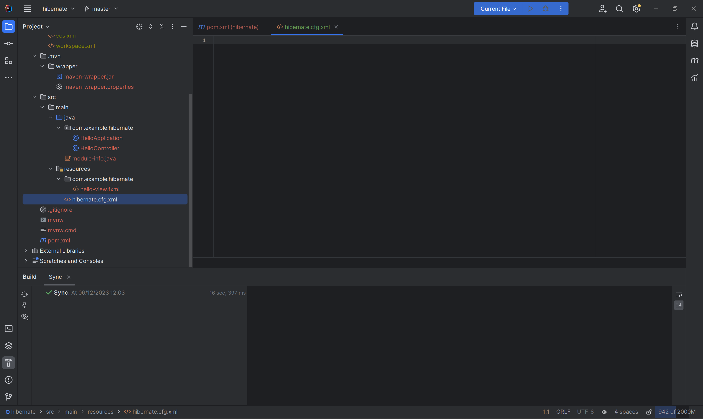

Skonfiguruj framework tworząc dokument XML. Przykładowa konfiguracja poniżej:

```xml
<?xml version="1.0" encoding="UTF-8"?>
<!DOCTYPE hibernate-configuration PUBLIC
        "-//Hibernate/Hibernate Configuration DTD 3.0//EN"
        "http://hibernate.org/dtd/hibernate-configuration-3.0.dtd">
<hibernate-configuration>
    <session-factory>
        <!-- Adres do bazy danych C:\.. należy zastapić pełną ścieżką do bazy danych znajdującej się na komputerze  -->
        <property name="hibernate.connection.url">jdbc:sqlite:[ścieżka do bazy danych]</property>
        <property name="hibernate.connection.username">root</property>
        <property name="hibernate.connection.password">ZAQ!2wsx</property>
        <!-- Opcja będzie wypisywać zapytania SQL w konsoli -->
        <property name="hibernate.show_sql">true</property>
        <!-- scieżka do klasy sterownika -->
        <property name="hibernate.connection.driver_class">org.sqlite.JDBC</property>
        <!-- Dialekt bazy danych - silniki bazodanowe różnią się nieznacznie składnią, typami danych, funkcjami -->
        <property name="hibernate.dialect">org.sqlite.hibernate.dialect.SQLiteDialect</property>
        <!-- Opcja umożliwia zdefiniowanie zachowania przy łączeniu z bazą danych. create-drop usunie tabele a następnie utworzy je na nowo -->
        <property name="hibernate.hbm2ddl.auto">create-drop</property>

        <!-- Wskazanie klas mapujących tabele w bazie danych na obiekty java. -->
        <mapping class="com.example.hibernate.Powiat"></mapping>

    </session-factory>
</hibernate-configuration>
```

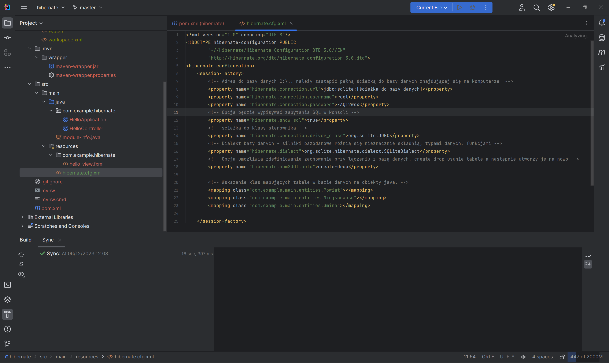

Utwórz klasę POJO Powiat.java przechowującą ID oraz nazwę powiatu.

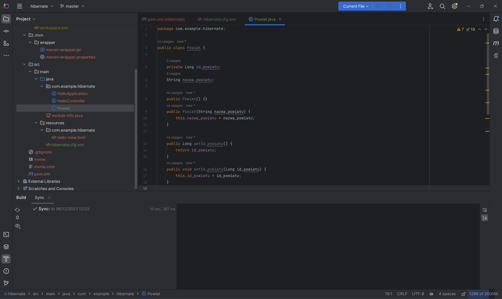

Sama klasa nie ma znaczenia, natomiast w frameworku hibernate jak i w frameworku JAXB wykorzystywane są adnotacje dzięki którym wskazujemy fameworkowi które pola klasy odpowiadają polom w naszej tabeli. Np. jak poniżej klasa Powiat będzie odpowiatać tabeli POWIAT. Pole id_powiatu będzie podpowiadać kolumnie id_powiatu oraz będzie to kolumna będąca kluczem głównym o czym mówi adnotacja @ID:

UWAGA: od JAVA 9 plik module-info.java określa widoczność klas pomiędzy bibliotekami. Stąd aby biblioteka jakarta persistence api była widoczna w pliku module-info.java należy dodać poniższy wpis:
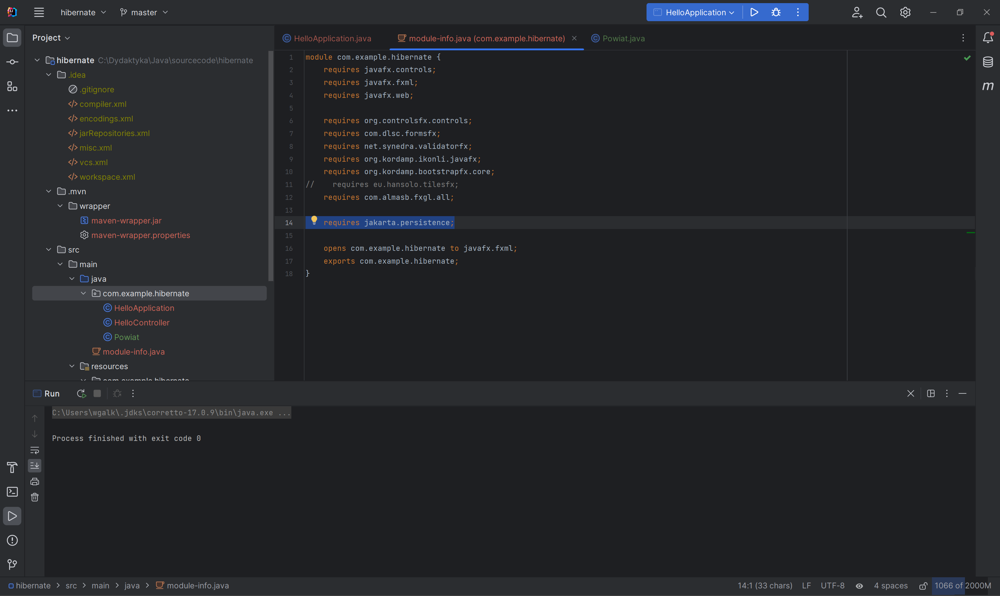

```java
import jakarta.persistence.*;

@Entity
@Table(name = "POWIAT")
public class Powiat {
    @Id
    @Column(name = "id_powiatu", nullable = false)
    @GeneratedValue(strategy = GenerationType.IDENTITY)
    private Long id_powiatu;

    @Column(name = "nazwa_powiatu")
    String nazwa_powiatu;

    public Powiat(String nazwa_powiatu) {
        this.nazwa_powiatu = nazwa_powiatu;
    }

    public Powiat() {}

    public Long getId_powiatu() {
        return id_powiatu;
    }

    public void setId_powiatu(Long id_powiatu) {
        this.id_powiatu = id_powiatu;
    }

    public String getNazwa_powiatu() {
        return nazwa_powiatu;
    }

    public void setNazwa_powiatu(String nazwa_powiatu) {
        this.nazwa_powiatu = nazwa_powiatu;
    }

    @Override
    public String toString() {
        return "Powiat{" +
                "id_powiatu=" + id_powiatu +
                ", nazwa_powiatu='" + nazwa_powiatu + '\'' +
                '}';
    }
}

```


