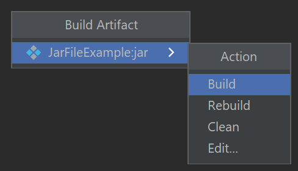

# Wdrażanie aplikacji

Podczas korzystania z IDE przy każdym uruchomieniu kodu jest on kompilowany narzędziem [`javac`](https://docs.oracle.com/javase/7/docs/technotes/tools/windows/javac.html). Skomilowany kod możemy uruchomić poleceniem `java` i wskazując plik z metodą main w utworzonych plikach. Pliki te możemy spakować do archiwum .zip i przekazywać osobom zainteresowanym nasze orpogramowanie jednak nie jest to wygodne rozwiązanie i wymaga przygotowania odpowiednich skryptów które będą uruchamiać nasz program.

Innym rozwiązaniem problemu wdrożenia plikacji są archiwa:
- [Jar(Java archive)](https://docs.oracle.com/javase/tutorial/deployment/jar/basicsindex.html)
- [War(Web application archive)](https://docs.oracle.com/cd/A91034_01/DOC/java.901/a90213/war.htm)

## Narzędzia do tworzenia Jar:
 - [Apache Maven JAR Plugin](https://maven.apache.org/plugins/maven-jar-plugin/)
 - [Apache Maven Shade Plugin](https://maven.apache.org/plugins/maven-shade-plugin/)

 ### Tworzenie pliku Jar w Intelij
 
 Należy wybrać opcję files > project structure

 

W zakładce Artifacts wybrać add > JAR > From modules with dependencies

W polu Main class wybieramy punkt startowy aplikacji (klasę z metodą main)

Potwierdzamy zmiany klikając Apply i ok.

W zakładce Build wybieramy Build Artifacts

A kolejno z następnego menu opcję Build

W katalogu out pojawi się wygenerowany plik JAR

Uwaga

W nowszych wersjach Java JVM może mieć problem z odczytaniem zależności jeśli JavaFX nie jest częścią Java. W takim przypadku należy utworzyć klasę Main która nie dziedziczy po klasie Application a w metodzie main wywołać metodę main której używaliśmy wcześniej.

Następnie proces tworzenia artefaktów należy wykonać od nowa wskazując nową metodę main()

 ## tworzenie pliku wykonywalnego z pliku .jar
- [Launch4j](https://launch4j.sourceforge.net/)
- [Jlink](https://maven.apache.org/plugins/maven-jlink-plugin/usage.html)

## Na co zwrócićuwagę:
- ścieżki w aplikacji - apliakcja powinna działać w dowolnej lokalizacji
- apliakcja powinna mieć wskazane miejsce startu - konkretną metodę main